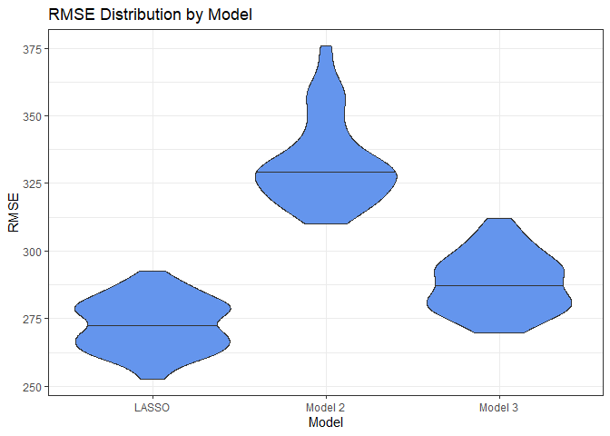

Homework 6
================

``` r
library(tidyverse)
library(p8105.datasets)
library(patchwork)
library(glmnet)
library(modelr)
```

# Problem 1

``` r
homicide_df = read_csv("data/homicide-data.csv")

homicide_df = 
  homicide_df |>
  mutate(
    reported_date = ymd(substr(homicide_df$reported_date, 1, 8)),
    city_state = paste(city, state, sep = ", "),
    solved = case_when(
      disposition %in% c("Open/No arrest", "Closed without arrest") ~ 0,
      disposition == "Closed by arrest" ~ 1),
    victim_age = as.numeric(victim_age)) |>
  filter(
    !(city_state %in% c("Dallas, TX",
                        "Phoenix, AZ",
                        "Kansas City, MO",
                        "Tulsa, AL")),
    victim_race %in% c("White", "Black"))
```

``` r
homicide_df |>
  filter(city_state == "Baltimore, MD") |>
  glm(solved ~ victim_age + victim_sex + victim_race, family = binomial(), data = _) |>
  broom::tidy() |>
  mutate(
    or_estimate = exp(estimate),
    or_lower = exp(estimate - std.error * 1.96),
    or_upper = exp(estimate + std.error * 1.96)) |>
  filter(term == "victim_sexMale") |>
  select(term, or_estimate, or_lower, or_upper)
```

    ## # A tibble: 1 × 4
    ##   term           or_estimate or_lower or_upper
    ##   <chr>                <dbl>    <dbl>    <dbl>
    ## 1 victim_sexMale       0.426    0.325    0.558

In Baltimore, MD, the adjusted odds ratio for solving homicides
comparing male victims to female victims, keeping all other variables
fixed, is 0.426 (95% CI: 0.325, 0.558).

``` r
glm_city_state = function(df) {
  
  glm(solved ~ victim_age + victim_sex + victim_race, 
      family = binomial(), 
      data = df)
  
}

city_state_glm_results = 
  homicide_df |>
  nest(data = -city_state) |>
  mutate(
    models = map(data, glm_city_state),
    results = map(models, broom::tidy)) |>
  select(city_state, results) |>
  unnest(results) |>
  mutate(
    or_estimate = exp(estimate),
    or_lower = exp(estimate - std.error * 1.96),
    or_upper = exp(estimate + std.error * 1.96)) |>
  filter(term == "victim_sexMale") |>
  select(city_state, term, or_estimate, or_lower, or_upper)


city_state_glm_results |>
  mutate(city_state = fct_reorder(city_state, or_estimate)) |>
  ggplot(aes(x = city_state, y = or_estimate)) +
  geom_point() +
  geom_errorbar(aes(ymin = or_lower,
                    ymax = or_upper)) +
  theme_bw() +
  theme(axis.text.x = element_text(angle = 45, vjust = 1, hjust = 1)) +
  labs(
    title = "Adjusted OR Estimates by City for Solving Homicides: Male vs Female Victims",
    x = "City",
    y = "Adjusted Odds Ratio")
```

<!-- -->

Keeping all other variables fixed, New York, NY has the lowest adjusted
odds ratio at 0.26 (95% CI: 0.14, 0.50), while Albuquerque, NM has the
highest at 1.77 (95% CI: 0.83, 3.76). In New York, this indicates that
the odds of solving a homicide with a male victim are about 74% lower
(95% CI: 50% to 86% lower) than the odds of solving a homicide with a
female victim. In Albuquerque, the odds of solving homicides with male
victims are about 77% higher (95% CI: 14% lower to 376% higher) than for
female victims.

# Problem 2

``` r
data("weather_df")

set.seed(6)
```

``` r
boot_straps =
  weather_df |>
  modelr::bootstrap(n = 5000)
```

``` r
boot_strap_results =
  boot_straps |>
  mutate(
    lm_fits = map(strap, \(df) lm(tmax ~ tmin + prcp, data = df)),
    glance_results = map(lm_fits, broom::glance),
    tidy_results = map(lm_fits, broom::tidy)) |>
  select(-strap, -lm_fits) |>
  unnest(
    c(glance_results, tidy_results), 
    names_sep = "_") |>
  select(
    .id, 
    tidy_results_term, 
    tidy_results_estimate, 
    glance_results_r.squared) |>
  filter(tidy_results_term != "(Intercept)") |>
  pivot_wider(
    names_from = "tidy_results_term",
    values_from = "tidy_results_estimate") |>
  rename(r.squared = glance_results_r.squared) |>
  mutate(
    tmin_prcp_ratio = tmin / prcp)
```

``` r
r_sq_dist =
  boot_strap_results |>
  ggplot(aes(x = r.squared)) +
  geom_density(fill = "cornflowerblue") +
  theme_bw() +
  labs(
    title = expression("Distribution of " * hat(r^2)),
    x = expression(hat(r^2)),
    y = "Density"
  )

b1_b2_dist = 
  boot_strap_results |>
  ggplot(aes(x = tmin_prcp_ratio)) +
  geom_density(fill = "cornflowerblue") +
  theme_bw() +
  labs(
    title = expression("Distribution of " * hat(beta)[1] / hat(beta)[2]),
    x = expression(hat(beta)[1] / hat(beta)[2]),
    y = "Density"
  )

(r_sq_dist + b1_b2_dist)
```

<!-- -->

The distribution for $\hat{r}^2$ is a roughly symmetric non-normal
distribution around 0.94.

The distribution for $\frac{\hat{\beta_1}}{\hat{\beta_2}}$ is a
left-skewed distribution with median around -180.

``` r
quantile(boot_strap_results$r.squared, probs = c(0.025, 0.5, 0.975))
```

    ##      2.5%       50%     97.5% 
    ## 0.9345154 0.9410790 0.9465507

``` r
quantile(boot_strap_results$tmin_prcp_ratio, probs = c(0.025, 0.5, 0.975))
```

    ##      2.5%       50%     97.5% 
    ## -277.6557 -179.9156 -125.6848

The quantity $\hat{r}^2$ is estimated to be 0.941 (95% CI: 0.934,
0.947).

The quantity $\frac{\hat{\beta_1}}{\hat{\beta_2}}$, where
$\hat{\beta_1}$ corresponds with minimum temperature and $\hat{\beta_2}$
corresponds with precipitation, is -180 (95% CI: -278, -126).

# Problem 3

``` r
# Data import and cleaning
birthweight_df = 
  read_csv("data/birthweight.csv") |>
  mutate(
    babysex = 
        case_match(
          babysex,
          1 ~ "male",
          2 ~ "female"),
    babysex = fct_infreq(babysex),
    frace = 
        case_match(
          frace,
          1 ~ "white",
          2 ~ "black", 
          3 ~ "asian", 
          4 ~ "puerto rican", 
          8 ~ "other",
          9 ~ "unknown"),
    frace = fct_infreq(frace),
    mrace = 
        case_match(
          mrace,
          1 ~ "white",
          2 ~ "black", 
          3 ~ "asian", 
          4 ~ "puerto rican",
          8 ~ "other"),
    mrace = fct_infreq(mrace),
    malform = as.logical(malform))
```

``` r
# Check for missing data
nrow(birthweight_df |> filter(if_any(everything(), is.na)))
```

    ## [1] 0

There are many variables we could use in a model to predict birthweight.
However, fitting a LASSO model should give us the best predictive model
by systematically choosing the variables for us.

``` r
# Create x and y variables
x = model.matrix(bwt ~ ., birthweight_df)[,-1]
y = birthweight_df |> pull(bwt)

# Get optimal lambda and fit LASSO model
lasso_cv = cv.glmnet(x, y)
lambda_opt = lasso_cv[["lambda.min"]]
lasso_fit = glmnet(x, y, lambda = lambda_opt)

# Extract LASSO model variables
coef_lasso = coef(lasso_fit)
selected_vars = rownames(coef_lasso)[coef_lasso[,1] != 0]
selected_vars = selected_vars[selected_vars != "(Intercept)"]
selected_vars = paste0("`", selected_vars, "`")

# Fit Linear Model using the LASSO model variables
# This workaround allows us to use `add_predictions()` & `add_residuals()` from modelr
x_df = as_tibble(x)
lm_formula = paste("y ~ ", paste(selected_vars, collapse = " + "))
lm_lasso = lm(lm_formula, data = x_df)

# Add residuals and predictions using modelr and plot
x_df |>
  add_residuals(lm_lasso) |>
  add_predictions(lm_lasso) |>
  select(pred, resid) |>
  ggplot(aes(x = pred, y = resid)) +
  geom_point(alpha = 0.4) +
  theme_bw() +
  labs(
    title = "Model Residuals Against Fitted Values",
    x = "Fitted Birthweight Predictions (grams)",
    y = "Model Residuals (grams)")
```

<!-- -->

**Building 3 models for birthweight**

- **Model 1:** LASSO
- **Model 2:** Main Predictors (Length at birth, gestational age)
- **Model 3:** Head circumference, length, sex, and all interactions

In order to compare the three models, we can create 100 training and
testing sets for cross validation. Then the distribution of RMSEs for
each model can plotted and compared to show which model approach is the
best.

``` r
cv_df =
  crossv_mc(birthweight_df, n = 100, test = 0.2)
```

``` r
# Create function for fitting LASSO model (Model 1)
lasso_func = function(df) {
  
  # Convert df to tibble
  df = as_tibble(df)
  
  # Create x and y variables
  x = model.matrix(bwt ~ ., df)[,-1]
  y = df |> pull(bwt)
  
  # Get optimal lambda and fit lasso model
  lasso_cv = cv.glmnet(x, y)
  lambda_opt = lasso_cv[["lambda.min"]]
  lasso_fit = glmnet(x, y, lambda = lambda_opt)
  
  return(lasso_fit)
  
}

# Create function for fitting Model 2
model_2_func = function(df) {
  
  # Create linear model using length at birth and gestational age
  lm_fit = lm(bwt ~ blength + gaweeks, data = df)
  
  return(lm_fit)
  
}

# Create function for fitting Model 3
model_3_func = function(df) {
  
  # Create linear model using head circumference, length, sex, and all interactions
  lm_fit = lm(bwt ~ bhead * blength * babysex, data = df)
  
  return(lm_fit)
}
```

``` r
# Create RMSE function compatible with LASSO models
rmse_lasso_func = function(model, data) {
  
  # Convert df to tibble
  df = as_tibble(data)
  
  # Create x values and predictions
  x_test = model.matrix(bwt ~ ., df)[,-1]
  preds = predict(model, x_test)
  
  # Calculate RMSE
  rmse = sqrt(mean((preds - df$bwt)^2))
  
  return(rmse)
  
}
```

``` r
# Fit models and calculate RMSEs for each of the train/test datasets
cv_results =
  cv_df |>
  mutate(
    lasso_model = map(train, lasso_func),
    model_2 = map(train, model_2_func),
    model_3 = map(train, model_3_func),
    rmse_lasso = map2_dbl(lasso_model, test, \(mod, df) rmse_lasso_func(model = mod, data = df)),
    rmse_model_2 = map2_dbl(model_2, test, \(mod, df) rmse(model = mod, data = df)),
    rmse_model_3 = map2_dbl(model_3, test, \(mod, df) rmse(model = mod, data = df)),
  )
```

``` r
# Plot distribution of RMSEs for each model approach
cv_results |>
  select(starts_with("rmse")) |> 
  pivot_longer(
    everything(),
    names_to = "model", 
    values_to = "rmse",
    names_prefix = "rmse_") |> 
  mutate(model = fct_inorder(model)) |> 
  ggplot(aes(x = model, y = rmse)) + 
  geom_violin(fill = "cornflowerblue", draw_quantiles = 0.5) +
  theme_bw() +
  scale_x_discrete(labels = c("LASSO", "Model 2", "Model 3")) +
  labs(
    title = "RMSE Distribution by Model",
    x = "Model",
    y = "RMSE")
```

<!-- -->

As is evident by the violin plot, the LASSO model approach leads to the
lowest RMSE on average and is therefore the best modeling approach out
of the 3 models being compared.
