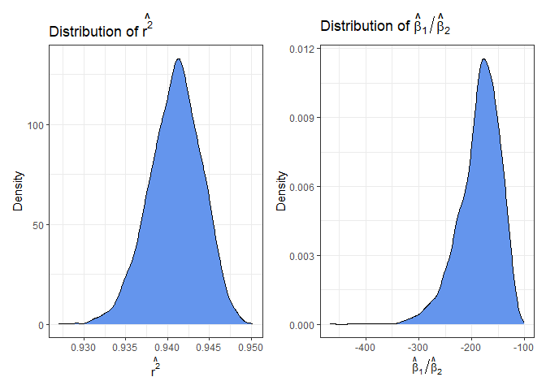
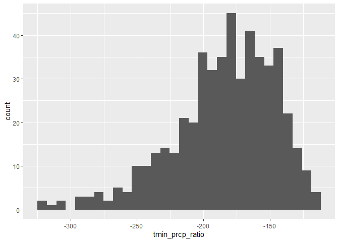

Homework 6
================

``` r
library(tidyverse)
library(p8105.datasets)
```

# Problem 1

``` r
homicide_df = read_csv("data/homicide-data.csv")

homicide_df = 
  homicide_df |>
  mutate(
    reported_date = ymd(substr(homicide_df$reported_date, 1, 8)),
    city_state = paste(city, state, sep = ", "),
    solved = case_when(
      disposition %in% c("Open/No arrest", "Closed without arrest") ~ 0,
      disposition == "Closed by arrest" ~ 1),
    victim_age = as.numeric(victim_age)) |>
  filter(
    !(city_state %in% c("Dallas, TX",
                        "Phoenix, AZ",
                        "Kansas City, MO",
                        "Tulsa, AL")),
    victim_race %in% c("White", "Black"))
```

``` r
homicide_df |>
  filter(city_state == "Baltimore, MD") |>
  glm(solved ~ victim_age + victim_sex + victim_race, family = binomial(), data = _) |>
  broom::tidy() |>
  mutate(
    or_estimate = exp(estimate),
    or_lower = exp(estimate - std.error * 1.96),
    or_upper = exp(estimate + std.error * 1.96)) |>
  filter(term == "victim_sexMale") |>
  select(term, or_estimate, or_lower, or_upper)
```

    ## # A tibble: 1 × 4
    ##   term           or_estimate or_lower or_upper
    ##   <chr>                <dbl>    <dbl>    <dbl>
    ## 1 victim_sexMale       0.426    0.325    0.558

In Baltimore, MD, the adjusted odds ratio for solving homicides
comparing male victims to female victims, keeping all other variables
fixed, is 0.426 (95% CI: 0.325, 0.558).

``` r
glm_city_state = function(df) {
  
  glm(solved ~ victim_age + victim_sex + victim_race, 
      family = binomial(), 
      data = df)
  
}

city_state_glm_results = 
  homicide_df |>
  nest(data = -city_state) |>
  mutate(
    models = map(data, glm_city_state),
    results = map(models, broom::tidy)) |>
  select(city_state, results) |>
  unnest(results) |>
  mutate(
    or_estimate = exp(estimate),
    or_lower = exp(estimate - std.error * 1.96),
    or_upper = exp(estimate + std.error * 1.96)) |>
  filter(term == "victim_sexMale") |>
  select(city_state, term, or_estimate, or_lower, or_upper)


city_state_glm_results |>
  mutate(city_state = fct_reorder(city_state, or_estimate)) |>
  ggplot(aes(x = city_state, y = or_estimate)) +
  geom_point() +
  geom_errorbar(aes(ymin = or_lower,
                    ymax = or_upper)) +
  theme_bw() +
  theme(axis.text.x = element_text(angle = 45, vjust = 1, hjust = 1)) +
  labs(
    title = "Adjusted OR Estimates by City for Solving Homicides: Male vs Female Victims",
    x = "City",
    y = "Adjusted Odds Ratio")
```

<!-- -->

Keeping all other variables fixed, New York, NY has the lowest adjusted
odds ratio at 0.26 (95% CI: 0.14, 0.50), while Albuquerque, NM has the
highest at 1.77 (95% CI: 0.83, 3.76). In New York, this indicates that
the odds of solving a homicide with a male victim are about 74% lower
(95% CI: 50% to 86% lower) than the odds of solving a homicide with a
female victim. In Albuquerque, the odds of solving homicides with male
victims are about 77% higher (95% CI: 14% lower to 376% higher) than for
female victims.

# Problem 2

``` r
data("weather_df")

set.seed(6)
```

``` r
boot_straps =
  weather_df |>
  modelr::bootstrap(n = 500) # Change to 5000 !!!
```

``` r
boot_strap_results =
  boot_straps |>
  mutate(
    lm_fits = map(strap, \(df) lm(tmax ~ tmin + prcp, data = df)),
    glance_results = map(lm_fits, broom::glance),
    tidy_results = map(lm_fits, broom::tidy)) |>
  select(-strap, -lm_fits) |>
  unnest(
    c(glance_results, tidy_results), 
    names_sep = "_") |>
  select(
    .id, 
    tidy_results_term, 
    tidy_results_estimate, 
    glance_results_r.squared) |>
  filter(tidy_results_term != "(Intercept)") |>
  pivot_wider(
    names_from = "tidy_results_term",
    values_from = "tidy_results_estimate") |>
  rename(r.squared = glance_results_r.squared) |>
  mutate(
    tmin_prcp_ratio = tmin / prcp)
```

``` r
boot_strap_results |>
  ggplot(aes(x = r.squared)) +
  geom_histogram()
```

    ## `stat_bin()` using `bins = 30`. Pick better value `binwidth`.

<!-- -->

``` r
boot_strap_results |>
  ggplot(aes(x = tmin_prcp_ratio)) +
  geom_histogram()
```

    ## `stat_bin()` using `bins = 30`. Pick better value `binwidth`.

<!-- -->
